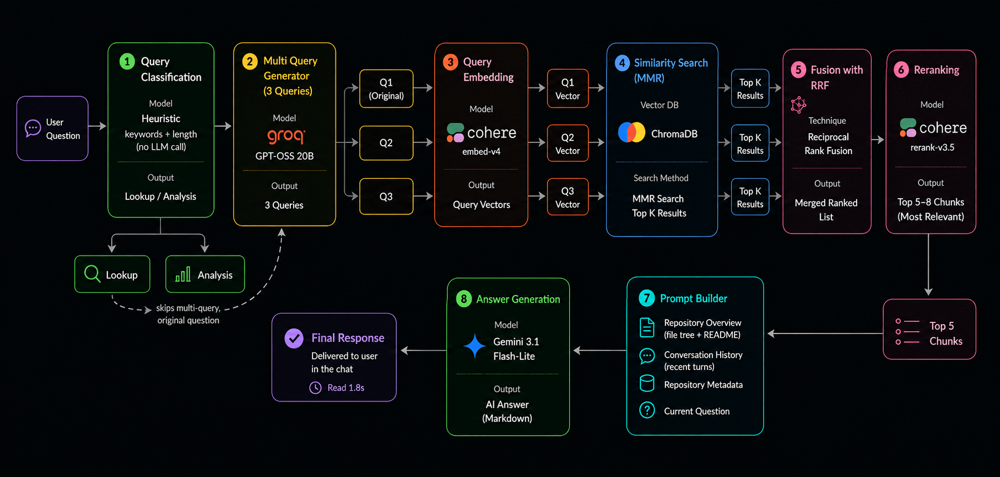
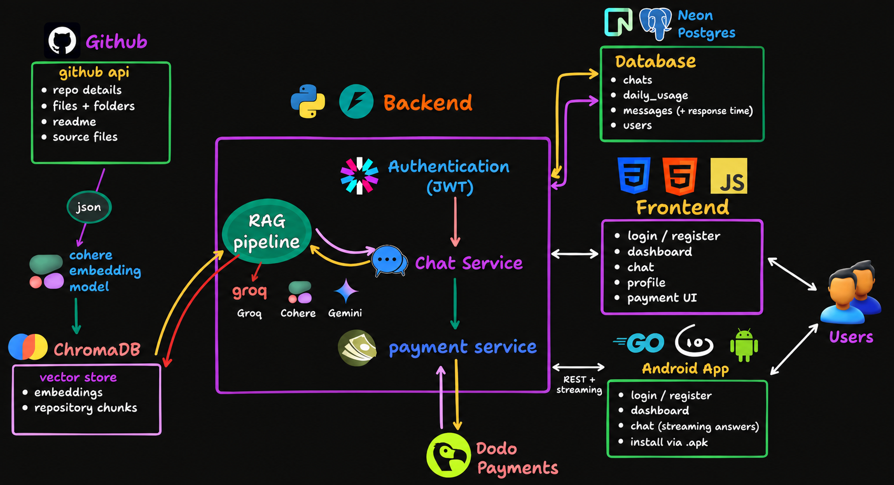

<div align="center">


# Chat With Repo

### Point it at any GitHub repository. Ask it anything. Get answers grounded in the actual code.

[](https://www.python.org/)
[](https://fastapi.tiangolo.com/)
[](https://www.langchain.com/)
[](#)

**[Live Demo](https://chatwithrepo-nine.vercel.app/) · [Problem](#-the-problem) · [RAG Pipeline](#-rag-pipeline) · [Architecture](#-full-architecture) · [Install](#-installation)**

</div>

---

## ◈ The Problem

```
clone repo  →  open 40 tabs  →  grep for the entry point  →  still lost
```

READMEs go stale, comments lie, and keyword search finds the word, not the concept. **Chat With Repo** indexes any public GitHub repository into a real retrieval pipeline, so you can ask questions and get answers grounded in the actual files — not a guess.

**Try it now → [chatwithrepo-nine.vercel.app](https://chatwithrepo-nine.vercel.app/)**

---

## ◈ RAG Pipeline

This is the core of the project — a multi-stage retrieval pipeline, not a single embed-and-search step:



| Stage | Model / Method | Purpose |
|---|---|---|
| Query Classification | Groq — `llama-3.1-8b-instant` | Routes the question as `lookup` (file/function/usage) or `analysis` (architecture/design) |
| Multi-Query Generation | Groq — `llama-3.1-8b-instant` | Rephrases the question into 2 alternate search queries to widen recall |
| Embedding & Retrieval | Cohere `embed-v4.0` + Chroma | Vector search over chunked repo documents |
| Fusion | Reciprocal Rank Fusion (RRF) | Merges results from the original + generated queries into one ranked list |
| Reranking | Cohere `rerank-v3.5` | Re-scores the fused results against the original question for precision |
| Answer Generation | Gemini `3.1-flash-lite` | Synthesizes the final answer from the top reranked chunks |

Before any of this, ingestion turns a raw repo into searchable documents: **GitHub API → Loader → Converter → Chunker → Embeddings → Vector Store**, plus synthetic repository-level summary documents to improve high-level "explain this codebase" queries.

---

## ◈ Full Architecture
 


Free vs Pro is enforced per-user (monthly repo limit, chat history depth); upgrades run through a Dodo Payments checkout + webhook flow.
```

**Free vs Pro** is enforced per-user (monthly repo limit, chat history depth); upgrades run through a Dodo Payments checkout + webhook flow.

---

## ◈ Installation

**Step 1 — Clone and install dependencies**

```bash
git clone https://github.com/anikchand461/chat-with-repo.git
cd chat-with-repo
uv sync
```

**Step 2 — Configure environment variables**

```bash
cp .env.example .env
```

```env
GROQ_API_KEY=your_groq_key        # classifier + multi-query
GOOGLE_API_KEY=your_gemini_key    # answer generation
COHERE_API_KEY=your_cohere_key    # embeddings + reranking
DODO_API_KEY=your_dodo_key        # optional, Pro plan
```

**Step 3 — Run the backend**

```bash
uv run uvicorn backend.app:app --reload
```

API comes up at `http://127.0.0.1:8000` — docs at `/docs`.

**Step 4 — Open the frontend**

```bash
cd frontend
python -m http.server 5500
```

Visit `http://127.0.0.1:5500/index.html`.

---

## ◈ Tech Stack

<div align="center">


</div>

---

<div align="center">

Built by [anikchand461](https://github.com/anikchand461)
and [shreyaghorui222004](https://github.com/shreyaghorui222004)

</div>
