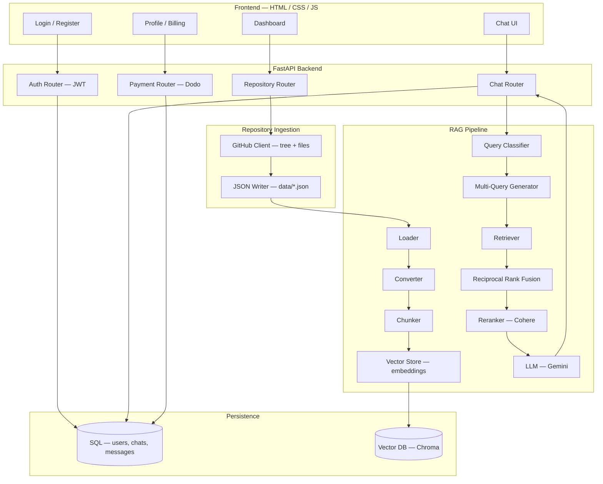

<div align="center">


# Chat With Repo

### Point it at any GitHub repository. Ask it anything. Get answers grounded in the actual code.

[](https://www.python.org/)
[](https://fastapi.tiangolo.com/)
[](https://www.langchain.com/)
[](#)
[](#)

**[Problem](#-the-problem) · [How it works](#-introducing-chat-with-repo) · [Architecture](#-full-architecture) · [Install](#-installation) · [Usage](#-usage) · [Roadmap](#-roadmap)**

</div>

---

## ◈ The Problem

Every new codebase starts the same way:

```
clone repo  →  open 40 tabs  →  grep for the entry point  →  still lost
```

READMEs go stale. Comments lie. Onboarding a new teammate — or your own AI assistant — onto an unfamiliar repository means hours of manual spelunking before anyone can ask a real question, let alone answer one.

A typical "understand this codebase" workflow is fragile in the same way every time:

- File trees are skimmed, not understood
- Search is keyword-only — it finds the word, not the concept
- There's no separation between "where is X" and "why does X work this way"
- Answers have no citations back to the actual file and line

**Chat With Repo fixes this.** Point it at any public GitHub repo, and it builds a searchable knowledge base of that codebase in seconds — then lets you ask it questions the way you'd ask a teammate who already read the whole thing.

---

## ◈ Introducing Chat With Repo

<div align="center">

| 1. INDEX | 2. ASK |
|:---:|:---:|
| Pull the repo tree + every file via the GitHub API, convert it into structured documents, chunk it, and embed it into a vector store. | Classify the question, generate query variants, retrieve + rerank + fuse results, and answer — grounded in the real files. |

</div>

Chat With Repo isn't a keyword search over your files. It's a full retrieval pipeline that treats a GitHub repository like a knowledge base: every file becomes a searchable, ranked, citable document.

| What it does | How |
|---|---|
| Pulls repo structure + file contents | GitHub REST API (`github/` client) |
| Turns raw files into documents | Loader → Converter → Chunker |
| Embeds & stores chunks | Cohere `embed-v4.0` → Vector Store |
| Understands question intent | Query Classifier (`lookup` vs `analysis`) |
| Widens the search net | Multi-Query Generator (2 rephrasings per question) |
| Merges multiple result sets | Reciprocal Rank Fusion (RRF) |
| Sharpens the top results | Cohere `rerank-v3.5` |
| Writes the final answer | Gemini (via LangChain) |

---

## ◈ Full Architecture



</br>

**Free vs Pro** is enforced per-user (monthly repo limit, chat history depth) and upgrades run through a Dodo Payments checkout + webhook flow.

---

## ◈ Installation

**Step 1 — Clone and install dependencies**

```bash
git clone https://github.com/anikchand461/chat-with-repo.git
cd chat-with-repo
uv sync
```

**Step 2 — Configure environment variables**

```bash
cp .env.example .env
```

```env
# LLMs / embeddings
GROQ_API_KEY=your_groq_key
GOOGLE_API_KEY=your_gemini_key
COHERE_API_KEY=your_cohere_key

# Auth
JWT_SECRET=your_jwt_secret

# Payments (optional, for Pro plan)
DODO_API_KEY=your_dodo_key
```

**Step 3 — Run the backend**

```bash
uv run uvicorn backend.app:app --reload
```

The API comes up at `http://127.0.0.1:8000` — interactive docs at `/docs`.

**Step 4 — Open the frontend**

```bash
cd frontend
# serve with any static server, e.g.
python -m http.server 5500
```

Visit `http://127.0.0.1:5500/index.html`, register an account, and connect a GitHub token to start indexing repos.

---

## ◈ Usage

1. **Register / log in** — JWT-based auth, stored per user.
2. **Add a repository** — paste an `owner/repo`, Chat With Repo pulls the tree and every file via the GitHub API.
3. **Wait for indexing** — files are chunked and embedded into a per-repo vector collection.
4. **Ask anything** — from *"where is the auth token validated?"* to *"how does the retrieval pipeline rank results?"* — the classifier routes lookup vs. analysis questions differently, and answers are grounded in the retrieved chunks.
5. **Track usage** — free accounts get a capped number of repos/month and chat history; upgrading to Pro lifts the limits.

---

## ◈ Tech Stack

<div align="center">


</div>

---

## ◈ Roadmap

- [ ] Full-text `/search` and `/analysis` endpoints (currently scaffolded)
- [ ] Private repository support with per-user GitHub OAuth
- [ ] Streaming chat responses
- [ ] Source-file citations rendered inline in the chat UI
- [ ] Multi-branch indexing and diffing

---

## ◈ Contributing

Issues and pull requests are welcome — this project is under active development and the API surface may still shift.

<div align="center">

Built by [anikchand461](https://github.com/anikchand461)
and [shreyaghorui222004](https://github.com/shreyaghorui222004)

</div>